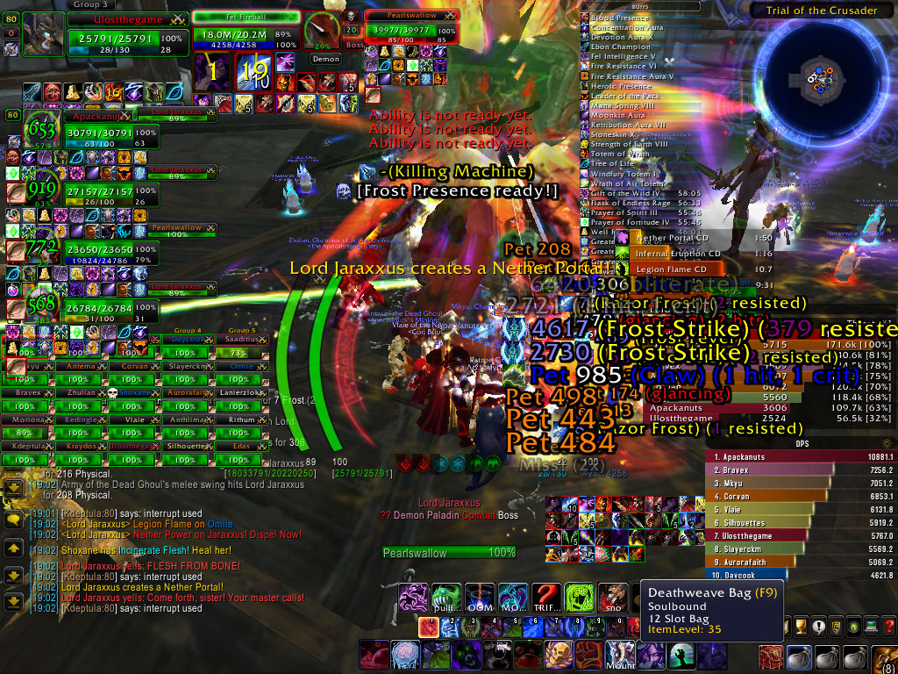
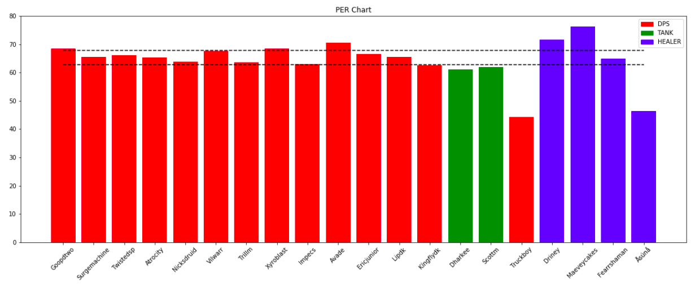

# Performance Metrics in MMORPGs

## Background
The player efficiency rating (PER) is an all-in-one basketball rating, which attempts to condense all of a player's contributions into one number. Using a detailed formula, the PER rates every player's statistical performance.

PER takes into account accomplishments, such as field goals, free throws, 3-pointers, assists, rebounds, blocks and steals, and negative results, such as missed shots, turnovers, and personal fouls. The formula adds positive stats and subtracts negative ones through a statistical point value system. In the end, one number sums up the players' statistical accomplishments for that season.

## Why PER for Gaming
Just like in basketball many team online games have many performance statistics to measures the player's contribution. One of the main game genres that historically has relied on such statistics is MMORPG games. Known by their overwhelming interfaces tracking many charts and stats that have become into a meme for "What the hell is going on here"

Games like FF14, World of Warcraft, Star Wars Old Republic & Guild Wars 2 are among titles known to use several statistics to measure the performance of a player. For years it has been a draw back the focus/need for the many addons and systems just to play a game. It's a strong criticism of the genre to be judge by just a number, let it be Item Level (iLvl), Damage done per second (DPS), or Healing done per second (HPS).

The anticipated MMORPG Ashes of Creation has taken another route. They have announced that addons won't be possible in the game, and on top of that, they are not using any of the trite meters like DPS or HPS. These announcements have thrown out of their comfort zone some raid leaders that ask for a means to manage a raid. It is understandable wanting to have a management system for a leader that must coordinate 20-50 players, lets face it, it is almost impossible to do so without some sort of system to know who is underperforming o who should be substituted for a specific boss fight. 

My middle ground solution is having some type of PER for MMOs. Game developers like AoC want to change the culture of the game, leading to a more social game, meanwhile, raid leaders just want to have the tools to help their teams. The game may not need 4-5 meters to track DPS, HPS, or Thread, perhaps with just one post-fight meter, we can satisfy both needs. I believe having only a PER post-fight meter on instanced dungeons would be enough for High-end raiders to work with.

### Player Culture

Culture is part of today's videogame. Dealing with toxicity, Min-Maxers, Casuals, and Bots are among the day-to-day challenges many developers have to face. Mmorpgs have divided players into casuals and Min-Maxers. The formers are just chilling, using all the "quality of life features" the game offers to achieve the maximum regard with the minimum effort. Min-maxers on the other hand want to be the best of the best, optimizing their character to the last digit. 

Players have become accustomed to not having to know their teammates. Some games have streamlined the whole process of getting to know someone, playing with them, and finally deciding if you want to play with them again. Now it's just a button, some interface with a minimum requirement that you're looking for (iLvl, Class, Role), and that's it. You have a new group, that you don't need to interact with and that you don't need to befriend, because the next time you need to find a teammate the game will find it for you.

### High-end gaming

High-end guids and players really need the data. They need to try and tweak every part of ther character in order to know what gives them the advantage in raiding. Not having any means to measure your performance is detrimental to this player base. 

AoC attepmpts to have a 80%-20% breakdown of open world versus instanced dungeons/raids. So, in reality high-end raiders woud only have the intanced dungeons as a control environment to perform. I believe having only a PER post-fight meter on instanced dungeons would be enough for High-end raiders to work with.

### Developers Design

Developers have painted themselves into a corner. Giving players the ability to measure every aspect of their performance has allowed players to demand balance in what they expect their character to perform. But not all classes play the same and are not meant just to perform in a single metric. 

For example, a Druid in Wow had the ability to play as DPS, Tank, or Healer, but if a Druid played as a DPS he had an advantage and a disadvantage. Druids could be a middle-tier DPS class, therefore they would complain and ask for the Developers to balance them, resulting in a buff adding more damage to their class. After this happens, the rest of the DPS Classes would complain about how Druids could do such damage and at the same time have the ability to heal themselves (At least for a little bit). As a result, Developers would eventually give every DPS a self-healing ability, officially balancing the issue. You see where I'm going here, Developers end up Hyperbalancing their classes as a result of everyone wanting to be higher in every meter they have access to.

Most developers want to design classes that are different, that have strengths and weaknesses. Some classes may be more mobile, resilient, bursty, pungent, or flexible. There are many facets of design but there can not be a single meter for every trait of design. Having meters can harm the design of video games but it's also needed in competitive genres.

## My PER for MMO

> If you want to see the full analysis of a boss fight and read on how I arrive at this formula I recommend checking this [notebook](PER.ipynb)

PER typically adds the positive impact and subtracts the negative impact in a game. In an MMO we have classes that contribute through putting out damage, healing, or soaking incoming damage (only Tank). There is also something to be said about interactions in a fight. Most MMOs try to design fights with different mechanics that teams must coordinate to solve. This is also a positive impact in the game, a DPS who stops attacking the boss to go and activate a box or to interrupt something should be awarded a positive impact for doing the mechanics, compensating the DPS loss.

A player's negative impact can be taking damage, at least more than you are supposed to, this can indicate your not doing correctly the mechanics (For God's sake, don't stand in the fire). In the case of Tanks Damage taken as a metric can be positive as they will always have a higher damage intake. For the Tanks, I will not be using Damage Taken but Mitigation (%Damage mitigated). Among tanks the ability to mitigate more damage means that your healer won't need to heal you as much, this is the mark of an excellent tank.

I will be taking the normalized version of the raw metrics (DPS, HPS, DTPS, Mitigated, and Impact). Normalizing the variables will allow me to have an equalized frame to compare the contribution of players across metrics. What I'm aiming to do is to have a metric between 100 and 25, so if you have the highest DPS in the fight you'll get a score of 100 in the DPS metric.

I am assuming DTPS as a negative metric, therefore I will be inverting the values, meaning that if you received the least damage you will receive a score of 100 in the metric. To solve the issue of a player dying early in the fight, and therefore appears as a "not taking damage hero" I'm going to average the score between **DTPS** and **TimeAlive**.

Now to the formula:

$$PER = p\cdot( DPS + HPS + \frac{DTPS + TA}{2} ) + i \cdot INT $$

- $p$ is the percentage of contribution to the final score for the metrics DPS, HPS, and Survivability
- $DPS$ is the normalized score for the Damage Done Per Second
- $HPS$ is the normalized score for the Healing Done Per Second
- $DTPS$ is the normalized score for the inverse Damage Taken Per Second
- $TA$ is the normalized score for the Time Alive
- $i$ is the percentage of contribution to the final score for Interaction score.
- $INT$ is the normalized score for the Interactions in a fight
- Where $3p+i=1$

For this exercise I used the values of $p=0.3$ and $i=0.1$ , meaning that I gave a 30% importance to DPS, HPS, and DTPS each, while assigning a 10% to Interactions.

## Results 

> You can find the full results in this [notebook](PER.ipynb)

The following chart comes from analyzing the performance of Complexity Limit on the Council of Blood in Castle Nathria.

It's great to see that pretty much everyone is pulling their own weight. This graph is just what you expect from a high-end raiding guild. With a few exceptions, most players are solid contributors (25%-75%). Special mention to _Maeveycakes_ , _Driney_ , _Avade_ , _Xyroblast_, and _Gooptwo_ as Strong contributors to the fight, they are in the upper quintile (Above 75%).

Using this **PER**, we are able to see that there are some really solid contributors. _Avade_ that was on a lower tier in terms of DPS is one of the top contributors using the **PER**. He was doing a little bit of everything, just being a great raider for his team. _Maeveycakes_ came out as the top performer, doing everything great; healing, interrupting, not taking too much damage. _Impecs_ and _Kingflydk_ are perhaps the lower contributors from the DPS bunch (Outside the deceased _Truckboy_), if the raid was lacking damage done I would point to these 2 to up their game (Looking just at this fight data).

**PER** can avoid falling into the skewed trap of seeing the raid only in terms of DPS and HPS. It gives a better understanding of who is contributing more and less to a boss fight. 